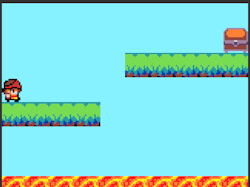

# Platform game tutorial

## Introductie @showdialog

Welkom! In deze tutorial leren we je stap voor stap hoe je een leuke platform game maakt. In het spel moet de speler de schat vinden, maar als die in de lava valt heeft de speler verloren. 



(version: 1.12.60)


## Achtergrond kleur instellen

Voeg een blok toe om de achtergrondkleur van het spel te veranderen naar blauw. Dit blok is te vinden in de ``||scene:Scene||`` categorie.

Voeg het blok ``||scene:set background color to []||`` toe aan ``||loops:on start||``. Door op het vakje achteraan het blok te klikken kun je een kleur kiezen.


~hint Meer uitleg 🤷🏽

Alles wat in het blok ``||loops:on start||`` staat wordt uitgevoerd als het spel opstart. Door het blok ``||scene:set background color to []||`` toe te voegen krijgt het spel een andere achtergrond kleur. 

hint~


```blocks
scene.setBackgroundColor(9)
```


## Sprite voor de speler toevoegen

In deze stap gaan we een sprite toevoegen voor de speler. Als de sprite is toegevoegd willen we deze kunnen besturen met de pijltjestoetsen. 

~hint Wat is een sprite? 🤷🏽

Een sprite is een soort plaatje die je aan het spel toevoegd en die we daarna kunnen programmeren. We kunnen de sprite bijvoorbeeld laten bewegen door het spel. Een sprite kunnen we gebruiken voor bijvoorbeeld de speler, een vijand of muntjes die je moet verzamelen.

hint~

Voeg het blok ``||variables(sprites):set [mySprite] to sprite [ ] of kind [Player]||`` toe aan ``||loops:on start||``. Deze kan je vinden in de categorie ``||sprites:Sprites||`` 

Voeg daarna het blok ``||contoller:move [mysprite] with buttons||`` toe.


```blocks
scene.setBackgroundColor(9)
let speler = sprites.create(img`
    . . . . . . . . . . . . . . . . 
    . . . . . f f f f f f . . . . . 
    . . . f f e e e e f 2 f . . . . 
    . . f f e e e e f 2 2 2 f . . . 
    . . f e e e f f e e e e f . . . 
    . . f f f f e e 2 2 2 2 e f . . 
    . . f e 2 2 2 f f f f e 2 f . . 
    . f f f f f f f e e e f f f . . 
    . f f e 4 4 e b f 4 4 e e f . . 
    . f e e 4 d 4 1 f d d e f . . . 
    . . f e e e e e d d d f . . . . 
    . . . . f 4 d d e 4 e f . . . . 
    . . . . f e d d e 2 2 f . . . . 
    . . . f f f e e f 5 5 f f . . . 
    . . . f f f f f f f f f f . . . 
    . . . . f f . . . f f f . . . . 
    `, SpriteKind.Player)
controller.moveSprite(speler)
```

## Platforms toevoegen

Om een level met platforms te maken voegen we een tilemap toe aan ons spel.

~hint Wat is een tilemap? 🤷🏽

Een tilemap is een raster van tegels (tiles) die samen een spelwereld of level vormen. Elke tegel is een afbeelding die een de achtergrond, een platform, een muur of een ander onderdeel van het spel is.

hint~

Voeg het blok ``||scene:set tilemap to [tilemap]||`` toe aan het blok ``||loops:on start||``.

Voeg daarna tiles toe aan de tilemap die je hebt toegevoegd. Dit kun je doen door op het witte vlak aan het einde van het blok te klikken. Deze tiles gebruiken we als platforms waar de speler op kan springen.

Om het spel te laten weten dat we op de platforms moeten kunnen staan geven we in de tilemap editor aan dat het 'walls' of 'muren' zijn.

Om ervoor te zorgen dat we door het hele level kunnen bewegen willen we er voor zorgen dat de camera meebeweegt met de speler.

Dit kunnen we doen door het blok ``||scene:camera follow sprite [mysrpite]||`` toe te voegen aan ``||loops:on start||``.

```blocks
scene.setBackgroundColor(9)
let speler = sprites.create(img`
    . . . . . . . . . . . . . . . . 
    . . . . . f f f f f f . . . . . 
    . . . f f e e e e f 2 f . . . . 
    . . f f e e e e f 2 2 2 f . . . 
    . . f e e e f f e e e e f . . . 
    . . f f f f e e 2 2 2 2 e f . . 
    . . f e 2 2 2 f f f f e 2 f . . 
    . f f f f f f f e e e f f f . . 
    . f f e 4 4 e b f 4 4 e e f . . 
    . f e e 4 d 4 1 f d d e f . . . 
    . . f e e e e e d d d f . . . . 
    . . . . f 4 d d e 4 e f . . . . 
    . . . . f e d d e 2 2 f . . . . 
    . . . f f f e e f 5 5 f f . . . 
    . . . f f f f f f f f f f . . . 
    . . . . f f . . . f f f . . . . 
    `, SpriteKind.Player)
controller.moveSprite(speler)
// @highlight
tiles.setCurrentTilemap(tilemap`level1`)
// @highlight
scene.cameraFollowSprite(speler)
```

## Zwaartekracht

De speler kan nu door het gemaakte level bewegen. Maar om ervoor te zorgen dat de speler naar beneden valt en op de platforms kan springen willen we zwaartekracht toevoegen.

Om dit te doen voegen we het blok ``||sprites:set [mysprite] [x] to [0]||`` toe aan het blok ``||loops:on start||``. Verander de 'x' naar 'y-acceleration' en de '0' naar '350'.

~hint Meer uitleg 🤷🏽

Met 'y-acceleration' stellen we in dat het spel de y snelheid steeds probeert te vehogen. De y staat voor de verticale richting (van boven naar beneden). Doordat die snelheid steed hoger wordt vallen we naar beneden totdat we ergens tegenaan botsen. Bijvoorbeeld een platform.

hint~

```blocks
scene.setBackgroundColor(9)
let speler = sprites.create(img`
    . . . . . . . . . . . . . . . . 
    . . . . . f f f f f f . . . . . 
    . . . f f e e e e f 2 f . . . . 
    . . f f e e e e f 2 2 2 f . . . 
    . . f e e e f f e e e e f . . . 
    . . f f f f e e 2 2 2 2 e f . . 
    . . f e 2 2 2 f f f f e 2 f . . 
    . f f f f f f f e e e f f f . . 
    . f f e 4 4 e b f 4 4 e e f . . 
    . f e e 4 d 4 1 f d d e f . . . 
    . . f e e e e e d d d f . . . . 
    . . . . f 4 d d e 4 e f . . . . 
    . . . . f e d d e 2 2 f . . . . 
    . . . f f f e e f 5 5 f f . . . 
    . . . f f f f f f f f f f . . . 
    . . . . f f . . . f f f . . . . 
    `, SpriteKind.Player)
controller.moveSprite(speler)
tiles.setCurrentTilemap(tilemap`level1`)
scene.cameraFollowSprite(speler)
// @highlight
speler.ay = 350
```

## Springen

Als volgende stap willen we de speler kunnen laten springen. Dat kunnen we doen door de y-snelheid van de speler in te stellen op -150 als er op de a knop wordt gedrukt. Voeg hiervoor een ``||controller: on [A] button [pressed]||`` blok toe met daarin het blok ``||set [mysprite] [x] to [0]||``. Verander de waardes in dit blok naar 'velocity y' en '-150'.

Om ervoor te zorgen dat we niet in de lucht kunnen springen willen we de y-snelheid alleen veranderen als deze op dat moment 0 is. Dit kan met een ``||logic:if [true] then||`` blok met daarin ``||logic:[mysprite][vy (velocity y)] = [0]||``.

```blocks
scene.setBackgroundColor(9)
let speler = sprites.create(img`
    . . . . . . . . . . . . . . . . 
    . . . . . f f f f f f . . . . . 
    . . . f f e e e e f 2 f . . . . 
    . . f f e e e e f 2 2 2 f . . . 
    . . f e e e f f e e e e f . . . 
    . . f f f f e e 2 2 2 2 e f . . 
    . . f e 2 2 2 f f f f e 2 f . . 
    . f f f f f f f e e e f f f . . 
    . f f e 4 4 e b f 4 4 e e f . . 
    . f e e 4 d 4 1 f d d e f . . . 
    . . f e e e e e d d d f . . . . 
    . . . . f 4 d d e 4 e f . . . . 
    . . . . f e d d e 2 2 f . . . . 
    . . . f f f e e f 5 5 f f . . . 
    . . . f f f f f f f f f f . . . 
    . . . . f f . . . f f f . . . . 
    `, SpriteKind.Player)
controller.moveSprite(speler)
scene.cameraFollowSprite(speler)
tiles.setCurrentTilemap(tilemap`level1`)
speler.ay = 350

// @highlight
controller.A.onEvent(ControllerButtonEvent.Pressed, function () {
    if (speler.vy == 0) {
        speler.vy = -150
    }
})
```

## Verliezen

Om de speler te laten verliezen als deze van een platform afvalt kunnen we het level aanpassen door onderin het level bijvoorbeeld lava tiles toe te voegen.

Wanneer de speler deze raakt is het spel afgelopen en heeft die verloren. Dit kan met een ``||scene: on [sprite] of kind [player] overlaps [] at [location]||`` en ``||game:game over [win]||`` blok. Verander de waarde van dit blok naar 'lose'.

```blocks
scene.setBackgroundColor(9)
let speler = sprites.create(img`
    . . . . . . . . . . . . . . . . 
    . . . . . f f f f f f . . . . . 
    . . . f f e e e e f 2 f . . . . 
    . . f f e e e e f 2 2 2 f . . . 
    . . f e e e f f e e e e f . . . 
    . . f f f f e e 2 2 2 2 e f . . 
    . . f e 2 2 2 f f f f e 2 f . . 
    . f f f f f f f e e e f f f . . 
    . f f e 4 4 e b f 4 4 e e f . . 
    . f e e 4 d 4 1 f d d e f . . . 
    . . f e e e e e d d d f . . . . 
    . . . . f 4 d d e 4 e f . . . . 
    . . . . f e d d e 2 2 f . . . . 
    . . . f f f e e f 5 5 f f . . . 
    . . . f f f f f f f f f f . . . 
    . . . . f f . . . f f f . . . . 
    `, SpriteKind.Player)
controller.moveSprite(speler)
scene.cameraFollowSprite(speler)
tiles.setCurrentTilemap(tilemap`level1`)
speler.ay = 350

// @highlight
scene.onOverlapTile(SpriteKind.Player, lava, function (sprite, location) {
    game.gameOver(false)
})
```

## Winnen

Om de speler te laten winnen plaatsen we aan het einde van het level een kist (chest). Wanneer de speler deze raakt heeft die het spel uitgespeeld.

Ook dit kan weer met de blokken ``||scene: on [sprite] of kind [player] overlaps [] at [location]||`` en ``||game:game over [win]||`` blok. Zet de waarde nu op 'win'.

```blocks
scene.setBackgroundColor(9)
let speler = sprites.create(img`
    . . . . . . . . . . . . . . . . 
    . . . . . f f f f f f . . . . . 
    . . . f f e e e e f 2 f . . . . 
    . . f f e e e e f 2 2 2 f . . . 
    . . f e e e f f e e e e f . . . 
    . . f f f f e e 2 2 2 2 e f . . 
    . . f e 2 2 2 f f f f e 2 f . . 
    . f f f f f f f e e e f f f . . 
    . f f e 4 4 e b f 4 4 e e f . . 
    . f e e 4 d 4 1 f d d e f . . . 
    . . f e e e e e d d d f . . . . 
    . . . . f 4 d d e 4 e f . . . . 
    . . . . f e d d e 2 2 f . . . . 
    . . . f f f e e f 5 5 f f . . . 
    . . . f f f f f f f f f f . . . 
    . . . . f f . . . f f f . . . . 
    `, SpriteKind.Player)
controller.moveSprite(speler)
scene.cameraFollowSprite(speler)
tiles.setCurrentTilemap(tilemap`level1`)
speler.ay = 350

// @highlight
scene.onOverlapTile(SpriteKind.Player, chest, function (sprite, location) {
    game.gameOver(true)
})
```